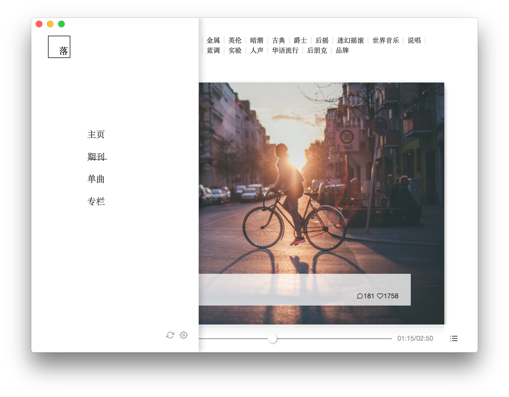
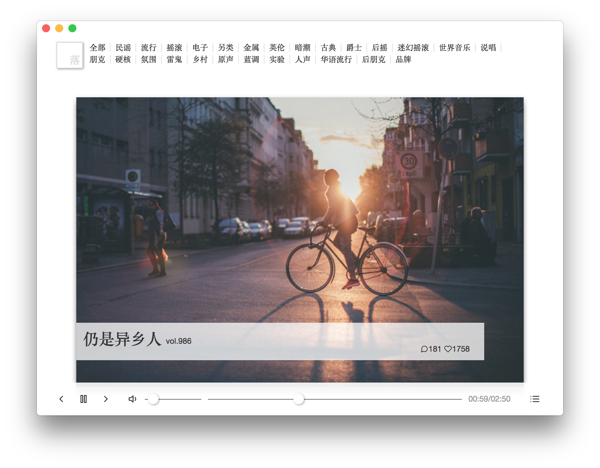
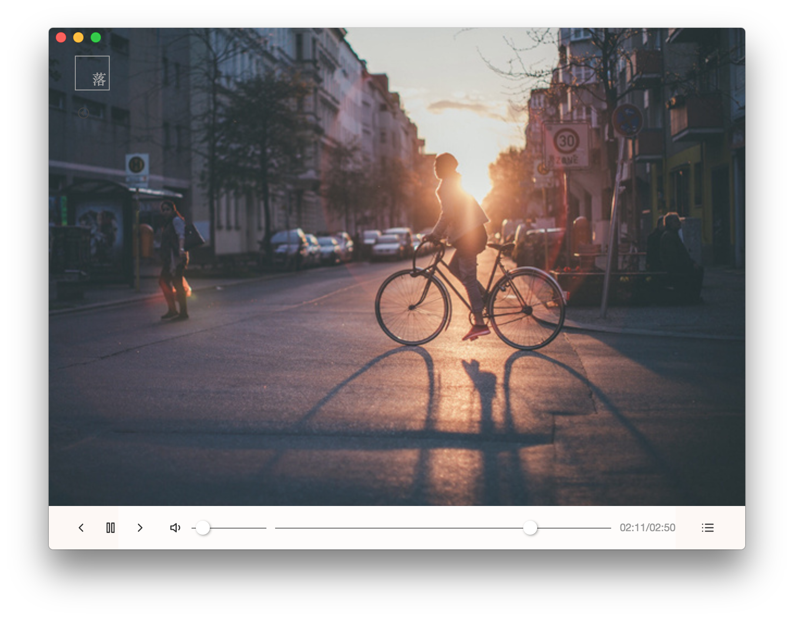
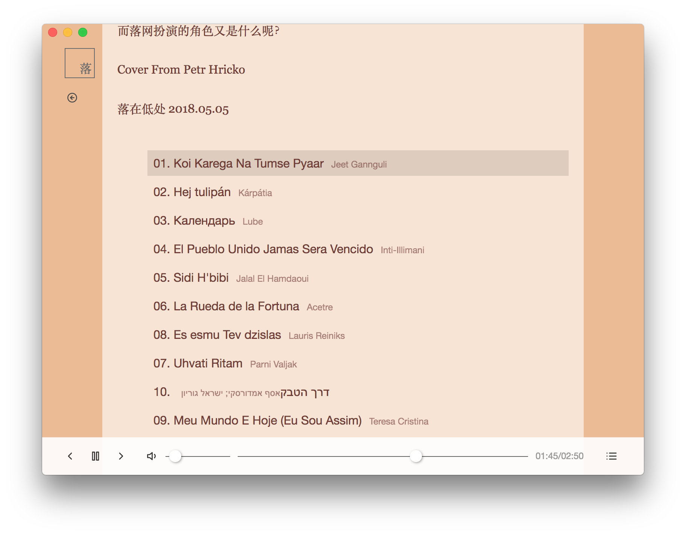

# nnecec-luoo

A [luoo.net](http://www.luoo.net/) electron unofficial client.

completed in development environment...

## Base

- [server-side](https://github.com/nnecec/nnecec-luoo-server)
- React
- React-Router
- MobX
- Babel
- Webpack
- Electron
- Axios
- Anime.js
- styled-components

All dependencies is up to date.

## Screenshots

## Note

[x] view vol && play music

[] pack && release .dmg

[] main page && multiple pages

[] redesign interaction design
